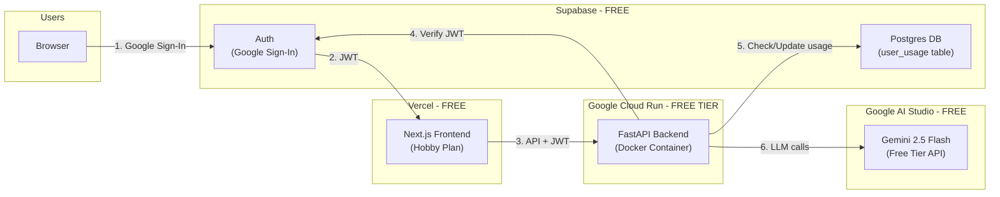
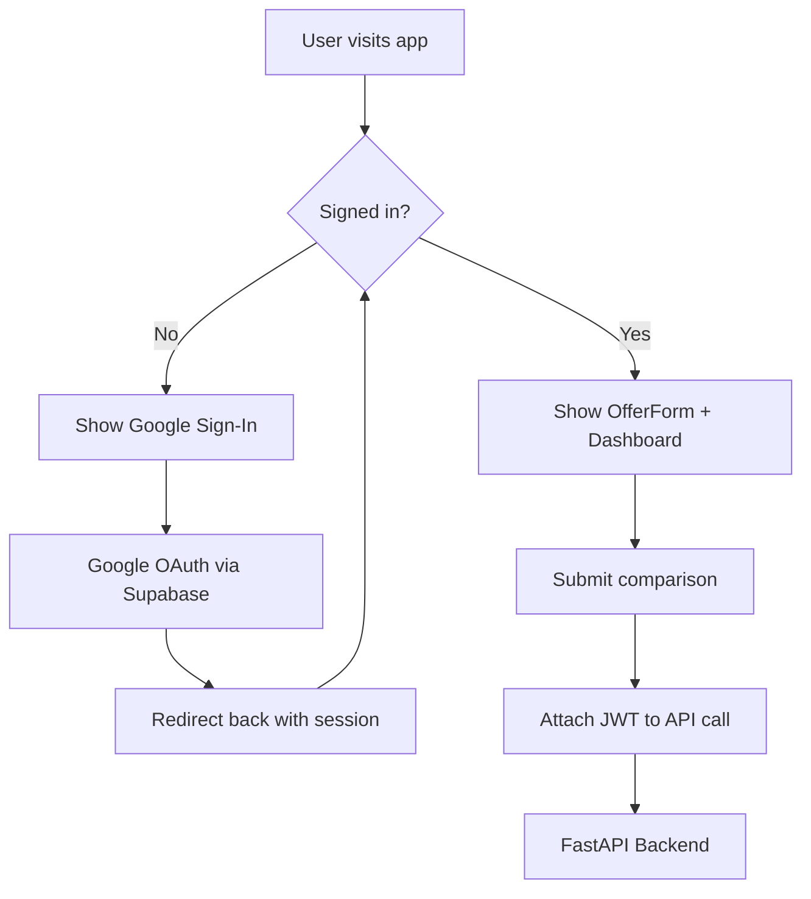
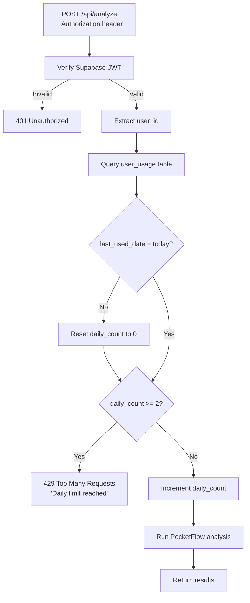

# BenchMarked Launch Deployment Plan

## Architecture Overview




---

## Decision Summary

- **Frontend hosting**: Vercel (Hobby/Free) -- Native Next.js support, zero-config, 100K function invocations/mo, HTTPS + CDN included
- **Backend hosting**: Google Cloud Run (Free Tier) -- Docker support, scales to zero, $300 new-account credit, generous free tier
- **LLM Provider**: Google Gemini API via AI Studio (NOT Vertex AI) -- Completely free tier, no credit card needed, 250 RPD on Flash model
- **Auth + Database**: Supabase (Free Tier) -- 50K MAU, Google Sign-In, 500MB Postgres DB for usage tracking, all in one service
- **Rate Limiting**: 2 comparisons per user per day -- enforced server-side via Supabase DB
- **Domain**: Custom domain on Vercel (free) or default `*.vercel.app`

---

## Why NOT These Alternatives

- **GitHub Pages / Google Sites**: Static-only hosting. Cannot run a FastAPI Python backend. Our app needs a server.
- **Vertex AI for LLM**: Requires Google Cloud billing setup, no free tier after 90-day trial. AI Studio Gemini API is free indefinitely.
- **Render Free Tier**: Spins down after 15 min inactivity, ~60s cold starts. Bad UX.
- **Railway**: Only $1/mo free credit, 0.5 GB RAM limit. Too constrained.
- **Vercel for Backend**: 60s max timeout on free plan. Our LLM analysis pipeline can take 30-90s+ which risks timeouts. Cloud Run allows up to 5 min.
- **Firebase Auth**: Would need a separate database for usage tracking. Supabase gives auth + DB in one free service.
- **Clerk Auth**: Great Next.js DX but no database included. Still need Supabase/Firebase for usage tracking -- two services instead of one.

---

## Phase 1: LLM API Key Setup (Cost: $0)

### Use Google Gemini API (AI Studio) - NOT Vertex AI

1. Go to [Google AI Studio](https://aistudio.google.com/) and sign in with a Google account
2. Click "Get API Key" -> "Create API key" (no credit card required)
3. Set the key as `GEMINI_API_KEY` in the environment
4. Set `DEFAULT_AI_PROVIDER=gemini` (already the default)

**Free Tier Limits (per project):**

- Gemini 2.5 Flash: 10 RPM, 250 RPD
- Gemini 2.5 Flash-Lite: 15 RPM, 1,000 RPD

**Capacity with 2/user/day rate limit:**

- 1,000 users x 2 analyses/day = 2,000 analyses/day max theoretical
- Each analysis makes ~5-8 LLM calls
- Free tier (250 RPD Flash) handles ~30-50 analyses/day -- works fine for early launch
- When usage grows, upgrade to paid: $0.002 per analysis = **$4/month for 2,000 analyses**

---

## Phase 2: Authentication + Rate Limiting with Supabase (Cost: $0)

### Why Supabase (one service for auth + database)

- **Free tier**: 50,000 MAU, 500MB Postgres database
- **Google Sign-In** built-in (one-click setup)
- **Next.js SDK** (`@supabase/ssr`) -- first-class support
- **Python client** (`supabase-py`) -- for backend JWT verification + DB queries
- Single service replaces what would otherwise be 2 (auth provider + database)

### Step 2a: Create Supabase Project

1. Go to [supabase.com](https://supabase.com), sign up (free, no credit card)
2. Create a new project (e.g., `benchmarked`)
3. Note down: `SUPABASE_URL`, `SUPABASE_ANON_KEY`, `SUPABASE_SERVICE_ROLE_KEY`, and `JWT_SECRET`

### Step 2b: Enable Google OAuth

1. In Supabase Dashboard -> Authentication -> Providers -> Google
2. Create OAuth credentials in [Google Cloud Console](https://console.cloud.google.com/apis/credentials):
  - OAuth 2.0 Client ID (Web application)
  - Authorized redirect URI: `https://<your-project>.supabase.co/auth/v1/callback`
3. Paste Client ID + Secret into Supabase Google provider settings

### Step 2c: Create Usage Tracking Table

Run this SQL in Supabase SQL Editor:

```sql
CREATE TABLE user_usage (
  user_id UUID REFERENCES auth.users(id) PRIMARY KEY,
  daily_count INT DEFAULT 0,
  last_used_date DATE DEFAULT CURRENT_DATE,
  total_analyses INT DEFAULT 0,
  created_at TIMESTAMPTZ DEFAULT NOW()
);

ALTER TABLE user_usage ENABLE ROW LEVEL SECURITY;

CREATE POLICY "Users can read own usage"
  ON user_usage FOR SELECT
  USING (auth.uid() = user_id);

CREATE POLICY "Service role full access"
  ON user_usage FOR ALL
  USING (auth.role() = 'service_role');
```

### Step 2d: Frontend Auth Changes (Next.js)

Files to create/modify:

- Install `@supabase/supabase-js` and `@supabase/ssr`
- Create `frontend/lib/supabase.ts` -- Supabase client initialization
- Create `frontend/components/AuthProvider.tsx` -- auth context wrapping the app
- Create `frontend/components/LoginButton.tsx` -- Google Sign-In button
- Modify `frontend/app/layout.tsx` -- wrap app in AuthProvider
- Modify `frontend/app/page.tsx` -- show login gate before the main UI
- Modify all API call sites (e.g., in `AnalysisResults.tsx`, `OfferForm.tsx`) -- attach JWT as `Authorization: Bearer <token>` header

**Auth flow on frontend:**




### Step 2e: Backend Auth + Rate Limiting Changes (FastAPI)

Files to create/modify:

- Add `supabase` and `PyJWT` to [requirements.txt](requirements.txt)
- Create `utils/auth.py` -- JWT verification + rate limit check
- Modify [api_server.py](api_server.py) -- add auth dependency to `/api/analyze` and `/api/analyze/quick`

**Backend request flow:**




**Key implementation details for `utils/auth.py`:**

```python
# Pseudocode for the auth middleware
import jwt
from supabase import create_client

SUPABASE_URL = os.environ["SUPABASE_URL"]
SUPABASE_SERVICE_KEY = os.environ["SUPABASE_SERVICE_ROLE_KEY"]
JWT_SECRET = os.environ["SUPABASE_JWT_SECRET"]

supabase = create_client(SUPABASE_URL, SUPABASE_SERVICE_KEY)

async def verify_and_rate_limit(authorization: str):
    # 1. Decode JWT
    token = authorization.replace("Bearer ", "")
    payload = jwt.decode(token, JWT_SECRET, algorithms=["HS256"], audience="authenticated")
    user_id = payload["sub"]
    
    # 2. Check/update usage in user_usage table
    today = date.today().isoformat()
    row = supabase.table("user_usage").select("*").eq("user_id", user_id).single().execute()
    
    if row.data is None:
        # First-time user: create row
        supabase.table("user_usage").insert({"user_id": user_id, "daily_count": 1, "last_used_date": today}).execute()
        return user_id
    
    if row.data["last_used_date"] != today:
        # New day: reset counter
        supabase.table("user_usage").update({"daily_count": 1, "last_used_date": today}).eq("user_id", user_id).execute()
        return user_id
    
    if row.data["daily_count"] >= 2:
        raise HTTPException(status_code=429, detail="Daily limit of 2 comparisons reached")
    
    # Increment
    supabase.table("user_usage").update({"daily_count": row.data["daily_count"] + 1}).eq("user_id", user_id).execute()
    return user_id
```

**Protected endpoints in `api_server.py`:**

- `POST /api/analyze` -- requires auth + rate limit check
- `POST /api/analyze/quick` -- requires auth + rate limit check
- `GET /api/demo` -- keep public (no auth needed, uses sample data)
- `GET /health`, `GET /api/levels`, `GET /api/positions` -- keep public
- Add `GET /api/usage` -- return current user's daily count (for frontend to show remaining)

### Environment Variables (new)

- `NEXT_PUBLIC_SUPABASE_URL` -- frontend
- `NEXT_PUBLIC_SUPABASE_ANON_KEY` -- frontend
- `SUPABASE_URL` -- backend
- `SUPABASE_SERVICE_ROLE_KEY` -- backend (never expose to frontend)
- `SUPABASE_JWT_SECRET` -- backend

---

## Phase 3: Backend Deployment - Google Cloud Run (Cost: $0-5/mo)

### Why Cloud Run

- Already have a `Dockerfile` ready
- Scales to zero (no charge when nobody is using it)
- Free tier: 2M requests/mo, 360K vCPU-seconds, 180K GiB-seconds
- New accounts get **$300 free credit** (valid 90 days)
- Handles long-running requests (up to 5 min timeout, perfect for LLM pipelines)

### Steps

1. **Create Google Cloud Project**
  - Go to [console.cloud.google.com](https://console.cloud.google.com)
  - Create a new project (e.g., `benchmarked-prod`)
  - Enable billing (required even for free tier; $300 credit covers it)
2. **Enable APIs**

```bash
   gcloud services enable run.googleapis.com artifactregistry.googleapis.com cloudbuild.googleapis.com
   

```

1. **Deploy the backend**

```bash
   gcloud run deploy benchmarked-api \
     --source . \
     --region us-central1 \
     --allow-unauthenticated \
     --set-env-vars "DEFAULT_AI_PROVIDER=gemini" \
     --memory 512Mi \
     --cpu 1 \
     --timeout 300 \
     --min-instances 0 \
     --max-instances 3
   

```

   You get a URL like `https://benchmarked-api-xxxxx.run.app`.

1. **Set up secrets** (for API keys and Supabase credentials)

```bash
   gcloud secrets create gemini-api-key --data-file=- <<< "your-gemini-key"
   gcloud secrets create supabase-url --data-file=- <<< "https://xxx.supabase.co"
   gcloud secrets create supabase-service-key --data-file=- <<< "your-service-role-key"
   gcloud secrets create supabase-jwt-secret --data-file=- <<< "your-jwt-secret"

   gcloud run services update benchmarked-api \
     --set-secrets "GEMINI_API_KEY=gemini-api-key:latest,SUPABASE_URL=supabase-url:latest,SUPABASE_SERVICE_ROLE_KEY=supabase-service-key:latest,SUPABASE_JWT_SECRET=supabase-jwt-secret:latest"
   

```

### Code Changes Required

- Update [api_server.py](api_server.py) CORS to include the Vercel domain (or read from env):

```python
  allow_origins = os.environ.get("ALLOWED_ORIGINS", "http://localhost:3000,http://localhost:3001").split(",")
  

```

- Add `PORT` env var fallback in `api_server.py` (Cloud Run sets `PORT` dynamically):

```python
  port = int(os.environ.get("PORT", 8001))
  

```

- Add to [requirements.txt](requirements.txt): `supabase>=2.0.0`, `PyJWT>=2.8.0`

---

## Phase 4: Frontend Deployment - Vercel (Cost: $0)

### Why Vercel

- Created Next.js, best-in-class support
- Free Hobby plan: 100K function invocations, 100 GB bandwidth
- Automatic HTTPS, CDN, preview deployments on every PR

### Steps

1. **Push code to GitHub** (if not already)
2. **Connect to Vercel**
  - Go to [vercel.com](https://vercel.com), sign up with GitHub
  - Import the repository, set root directory to `frontend`
  - Add environment variables:
    - `NEXT_PUBLIC_API_BASE` = `https://benchmarked-api-xxxxx.run.app`
    - `NEXT_PUBLIC_SUPABASE_URL` = `https://xxx.supabase.co`
    - `NEXT_PUBLIC_SUPABASE_ANON_KEY` = your anon key
3. **Deploy** -- Vercel auto-builds and deploys on every `git push`
4. **Custom Domain** (optional, free) -- buy a domain (~$10/year) or use `*.vercel.app`

---

## Phase 5: CI/CD Pipeline Updates

The existing `.github/workflows/ci.yml` handles tests and linting. Add deployment:

- **Frontend**: Vercel auto-deploys from GitHub (no CI changes needed)
- **Backend**: Add a deploy step to CI that runs `gcloud run deploy` on push to `main`
  - Use Google Cloud GitHub Actions: `google-github-actions/auth` + `google-github-actions/deploy-cloudrun`
  - Store `GCP_SERVICE_ACCOUNT_KEY` as a GitHub secret

---

## Phase 6: Scaling Strategy (When You Hit Limits)

### LLM Rate Limits (first bottleneck)

- **Free tier**: $0 -- handles ~30-50 analyses/day
- **Paid Gemini Flash**: ~$4/mo for 2K analyses/day -- unlimited (pay per token)
- **Add Flash-Lite**: ~$2/mo -- offload non-critical calls for even cheaper

**Upgrade path**: Enable billing on the Gemini API key. Same key, higher limits. No code changes.

### Per-User Limit Adjustments

The `daily_count >= 2` check in `utils/auth.py` is easily adjustable:

- Increase to 5/day for premium users (future feature)
- Add weekly/monthly limits instead of daily
- Add an admin endpoint to override limits for specific users

### Infrastructure Scaling

- **Launch (0-100 users)**: Cloud Run 0-1 instances, Vercel Free, Supabase Free = **$0/mo**
- **Growth (100-500)**: Cloud Run 0-2 instances, Vercel Free, Supabase Free = **$0-5/mo**
- **Scale (500-1000)**: Cloud Run 0-3 instances (1Gi RAM), Supabase Free = **$5-15/mo**
- **Beyond (1000+)**: Cloud Run autoscale, Vercel Pro ($20), Supabase Pro ($25) = **$50-80/mo**

---

## Cost Summary

- **Gemini API (AI Studio)**: $0 at launch, $2-4/mo if you hit free limits
- **Supabase (auth + DB)**: $0 (free tier: 50K MAU, 500MB DB)
- **Cloud Run (backend)**: $0 (free tier + $300 credit)
- **Vercel (frontend)**: $0 (Hobby plan)
- **Domain (optional)**: $10/year
- **Total at launch**: **$0**
- **Total at 1K users**: **$0-15/mo**

---

## Implementation Checklist (Code Changes)

### New Files

1. `utils/auth.py` -- JWT verification + per-user rate limiting logic
2. `frontend/lib/supabase.ts` -- Supabase client init (browser + server)
3. `frontend/components/AuthProvider.tsx` -- session context for the app
4. `frontend/components/LoginButton.tsx` -- Google Sign-In UI

### Modified Files

1. [api_server.py](api_server.py) -- add auth dependency to analyze endpoints, CORS update, PORT env
2. [requirements.txt](requirements.txt) -- add `supabase`, `PyJWT`
3. [frontend/app/layout.tsx](frontend/app/layout.tsx) -- wrap in AuthProvider
4. [frontend/app/page.tsx](frontend/app/page.tsx) -- gate behind login
5. [frontend/package.json](frontend/package.json) -- add `@supabase/supabase-js`, `@supabase/ssr`
6. [frontend/next.config.js](frontend/next.config.js) -- add Supabase env vars
7. [docker-compose.yml](docker-compose.yml) -- add Supabase env vars for local dev
8. [Dockerfile](Dockerfile) -- no changes needed (pip install handles new deps)

### Infrastructure Setup (no code)

1. Create Supabase project + enable Google OAuth + run SQL for `user_usage` table
2. Get Gemini API key from AI Studio
3. Create GCP project + deploy to Cloud Run
4. Connect repo to Vercel + set env vars

