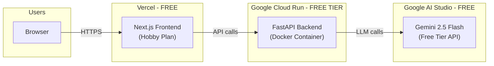

# BenchMarked Launch Deployment Plan

## Architecture Overview




---

## Decision Summary


| Decision         | Choice                                                   | Why                                                                                                               |
| ---------------- | -------------------------------------------------------- | ----------------------------------------------------------------------------------------------------------------- |
| Frontend hosting | **Vercel (Hobby/Free)**                                  | Native Next.js support, zero-config, 100K function invocations/mo, HTTPS + CDN included                           |
| Backend hosting  | **Google Cloud Run (Free Tier)**                         | Docker support, scales to zero (pay nothing when idle), $300 new-account credit, generous free tier               |
| LLM Provider     | **Google Gemini API via AI Studio** (NOT Vertex AI)      | Completely free tier, no credit card needed, 250 RPD on Flash model, supports the models already in `call_llm.py` |
| Domain           | Custom domain on Vercel (free) or default `*.vercel.app` |                                                                                                                   |
| Database         | None needed (current in-memory design works)             |                                                                                                                   |


---

## Why NOT These Alternatives

- **GitHub Pages / Google Sites**: Static-only hosting. Cannot run a FastAPI Python backend. Our app needs a server.
- **Vertex AI for LLM**: Requires Google Cloud billing setup, no free tier after 90-day trial. AI Studio Gemini API is free indefinitely.
- **Render Free Tier**: Spins down after 15 min inactivity, ~60s cold starts. Bad UX.
- **Railway**: Only $1/mo free credit, 0.5 GB RAM limit. Too constrained.
- **Vercel for Backend**: 60s max timeout on free plan. Our LLM analysis pipeline can take 30-90s+ which risks timeouts. Cloud Run allows up to 5 min.

---

## Phase 1: LLM API Key Setup (Cost: $0)

### Use Google Gemini API (AI Studio) - NOT Vertex AI

1. Go to [Google AI Studio](https://aistudio.google.com/) and sign in with a Google account
2. Click "Get API Key" -> "Create API key" (no credit card required)
3. Set the key as `GEMINI_API_KEY` in the environment
4. Set `DEFAULT_AI_PROVIDER=gemini` (already the default)

**Free Tier Limits (per project):**

- Gemini 2.5 Flash: 10 RPM, 250 RPD
- Gemini 2.5 Flash-Lite: 15 RPM, 1,000 RPD

**Capacity estimate for 1,000 users:**

- Each analysis makes ~5-8 LLM calls
- 250 RPD on Flash = ~30-50 analyses/day on free tier
- For more throughput: use Flash-Lite for non-critical calls (1,000 RPD) or upgrade to paid ($0.10/1M input tokens - extremely cheap)

**Recommendation:** Start free. If you hit limits, the paid tier is pennies. A full analysis (~5K tokens in + ~3K tokens out) costs roughly **$0.002** per analysis. 1,000 analyses/month = **$2/month**.

---

## Phase 2: Backend Deployment - Google Cloud Run (Cost: $0-5/mo)

### Why Cloud Run

- Already have a `Dockerfile` ready
- Scales to zero (no charge when nobody is using it)
- Free tier: 2M requests/mo, 360K vCPU-seconds, 180K GiB-seconds
- New accounts get **$300 free credit** (valid 90 days)
- Handles long-running requests (up to 5 min timeout, perfect for LLM pipelines)

### Steps

1. **Create Google Cloud Project**
  - Go to [console.cloud.google.com](https://console.cloud.google.com)
  - Create a new project (e.g., `benchmarked-prod`)
  - Enable billing (required even for free tier; $300 credit covers it)
2. **Enable APIs**

```bash
   gcloud services enable run.googleapis.com artifactregistry.googleapis.com cloudbuild.googleapis.com
   

```

1. **Deploy the backend**

```bash
   gcloud run deploy benchmarked-api \
     --source . \
     --region us-central1 \
     --allow-unauthenticated \
     --set-env-vars "GEMINI_API_KEY=your-key,DEFAULT_AI_PROVIDER=gemini" \
     --memory 512Mi \
     --cpu 1 \
     --timeout 300 \
     --min-instances 0 \
     --max-instances 3
   

```

   This builds the Docker image and deploys it. You get a URL like `https://benchmarked-api-xxxxx.run.app`.

1. **Set up secrets** (better practice than inline env vars)

```bash
   echo -n "your-gemini-key" | gcloud secrets create gemini-api-key --data-file=-
   gcloud run services update benchmarked-api \
     --set-secrets "GEMINI_API_KEY=gemini-api-key:latest"
   

```

### Code Changes Required

- Update [api_server.py](api_server.py) CORS to include the Vercel domain:

```python
  allow_origins=[
      "http://localhost:3000",
      "http://localhost:3001",
      "https://benchmarked.vercel.app",  # production
      "https://*.vercel.app",  # preview deployments
  ]
  

```

  Or better: read allowed origins from an environment variable.

- Add a `PORT` environment variable fallback in `api_server.py`:

```python
  port = int(os.environ.get("PORT", 8001))
  

```

  Cloud Run sets `PORT` dynamically.

---

## Phase 3: Frontend Deployment - Vercel (Cost: $0)

### Why Vercel

- Created Next.js, best-in-class support
- Free Hobby plan: 100K function invocations, 100 GB bandwidth
- Automatic HTTPS, CDN, preview deployments on every PR
- Zero config for Next.js

### Steps

1. **Push code to GitHub** (if not already)
2. **Connect to Vercel**
  - Go to [vercel.com](https://vercel.com), sign up with GitHub
  - Import the repository
  - Set root directory to `frontend`
  - Add environment variable: `NEXT_PUBLIC_API_BASE` = `https://benchmarked-api-xxxxx.run.app` (your Cloud Run URL)
3. **Deploy** - Vercel auto-builds and deploys on every `git push`
4. **Custom Domain** (optional, free)
  - Buy a domain (~$10/year from Namecheap/Cloudflare)
  - Or use the free `benchmarked.vercel.app` URL

### Code Changes Required

- Update [frontend/next.config.js](frontend/next.config.js) - the current config already reads `NEXT_PUBLIC_API_BASE` from env, so no changes needed for the config itself.

---

## Phase 4: CI/CD Pipeline Updates

The existing `.github/workflows/ci.yml` handles tests and linting. Add deployment:

- **Frontend**: Vercel auto-deploys from GitHub (no CI changes needed)
- **Backend**: Add a deploy step to CI that runs `gcloud run deploy` on push to `main`
  - Use Google Cloud GitHub Actions: `google-github-actions/auth` + `google-github-actions/deploy-cloudrun`
  - Store `GCP_SERVICE_ACCOUNT_KEY` as a GitHub secret

---

## Phase 5: Scaling Strategy (When You Hit Limits)

### LLM Rate Limits (first bottleneck)


| Tier                            | Cost                   | Capacity                   |
| ------------------------------- | ---------------------- | -------------------------- |
| Free (current)                  | $0                     | ~30-50 analyses/day        |
| Paid Gemini Flash               | ~$2/mo for 1K analyses | Unlimited (pay per token)  |
| Add Flash-Lite for simple calls | ~$1/mo                 | Offload non-critical calls |


**Upgrade path**: Just enable billing on the Gemini API key. Same key, higher limits. No code changes.

### Infrastructure Scaling


| Stage  | Users    | Backend                              | Frontend         | Monthly Cost |
| ------ | -------- | ------------------------------------ | ---------------- | ------------ |
| Launch | 0-100    | Cloud Run (0-1 instances)            | Vercel Free      | $0           |
| Growth | 100-500  | Cloud Run (0-2 instances)            | Vercel Free      | $0-5         |
| Scale  | 500-1000 | Cloud Run (0-3 instances, 1Gi RAM)   | Vercel Free      | $5-15        |
| Beyond | 1000+    | Cloud Run (autoscale) or move to GKE | Vercel Pro ($20) | $20-50       |


---

## Cost Summary


| Component              | Launch Cost                  | Monthly at 1K Users        |
| ---------------------- | ---------------------------- | -------------------------- |
| Gemini API (AI Studio) | $0 (free tier)               | $0-2 (paid tier if needed) |
| Cloud Run (backend)    | $0 (free tier + $300 credit) | $0-10                      |
| Vercel (frontend)      | $0 (Hobby plan)              | $0                         |
| Domain (optional)      | $10/year                     | $0.83/mo                   |
| **Total**              | **$0**                       | **$0-13/mo**               |


---

## Implementation Checklist

The code changes needed are minimal since Dockerfiles and docker-compose already exist. The main work is:

1. Get a Gemini API key from AI Studio
2. Minor CORS update in `api_server.py` for production domains
3. Add `PORT` env var support in `api_server.py`
4. Create Google Cloud project and deploy backend to Cloud Run
5. Connect GitHub repo to Vercel and deploy frontend
6. Set environment variables in both platforms
7. (Optional) Add Cloud Run deploy step to GitHub Actions CI

