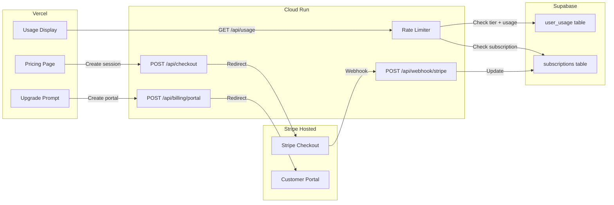
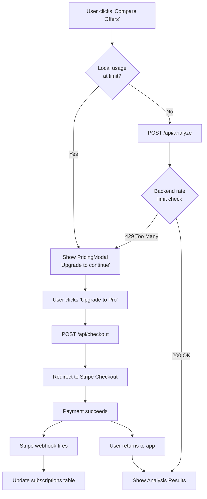

# BenchMarked Monetization Plan

## Why Stripe (over LemonSqueezy)

- First-class Python SDK (`stripe` PyPI) and Next.js integration
- Stripe Checkout: hosted payment page, zero frontend payment form complexity
- Stripe Customer Portal: users self-manage billing (cancel, upgrade, payment method)
- Supabase + Stripe is a well-documented pattern
- Webhooks handle all lifecycle events (subscription created, canceled, payment failed)
- Free to set up; 2.9% + 30c per successful transaction only

## Pricing Tiers

This is a **bursty-use** app (users compare offers mainly during job hunts), so monthly subscriptions with generous limits work best. Users can subscribe for 1-2 months while actively job hunting, then cancel.


| Tier  | Price  | Daily Limit | Monthly Limit | Features                    |
| ----- | ------ | ----------- | ------------- | --------------------------- |
| Free  | $0     | 2/day       | 5/month       | Basic analysis              |
| Pro   | $9/mo  | 10/day      | 50/month      | Full analysis + priority    |
| Power | $19/mo | Unlimited   | Unlimited     | Everything, unlimited usage |


## Architecture




---

## Phase 1: Database Schema Changes (Supabase)

### Modify `user_usage` table

Update the table from the deployment plan to add monthly tracking:

```sql
CREATE TABLE user_usage (
  user_id UUID REFERENCES auth.users(id) PRIMARY KEY,
  daily_count INT DEFAULT 0,
  last_used_date DATE DEFAULT CURRENT_DATE,
  monthly_count INT DEFAULT 0,
  monthly_reset_date DATE DEFAULT DATE_TRUNC('month', CURRENT_DATE)::DATE,
  total_analyses INT DEFAULT 0,
  created_at TIMESTAMPTZ DEFAULT NOW()
);
```

### New `subscriptions` table

```sql
CREATE TABLE subscriptions (
  id UUID DEFAULT gen_random_uuid() PRIMARY KEY,
  user_id UUID REFERENCES auth.users(id) UNIQUE NOT NULL,
  stripe_customer_id TEXT UNIQUE,
  stripe_subscription_id TEXT UNIQUE,
  tier TEXT NOT NULL DEFAULT 'free' CHECK (tier IN ('free', 'pro', 'power')),
  status TEXT NOT NULL DEFAULT 'active' CHECK (status IN ('active', 'canceled', 'past_due', 'incomplete')),
  current_period_start TIMESTAMPTZ,
  current_period_end TIMESTAMPTZ,
  created_at TIMESTAMPTZ DEFAULT NOW(),
  updated_at TIMESTAMPTZ DEFAULT NOW()
);

ALTER TABLE subscriptions ENABLE ROW LEVEL SECURITY;

CREATE POLICY "Users can read own subscription"
  ON subscriptions FOR SELECT
  USING (auth.uid() = user_id);

CREATE POLICY "Service role full access on subscriptions"
  ON subscriptions FOR ALL
  USING (auth.role() = 'service_role');
```

---

## Phase 2: Backend -- Stripe Integration

### New file: `utils/payments.py`

- Initialize Stripe with `STRIPE_SECRET_KEY` env var
- `create_checkout_session(user_id, tier, success_url, cancel_url)` -- creates Stripe Checkout Session
- `create_portal_session(stripe_customer_id, return_url)` -- creates Stripe Customer Portal session
- `get_user_tier(user_id)` -- queries `subscriptions` table, returns tier string
- Stripe product/price IDs stored as env vars: `STRIPE_PRO_PRICE_ID`, `STRIPE_POWER_PRICE_ID`

### New endpoints in [api_server.py](api_server.py)

- `POST /api/checkout` -- authenticated; accepts `{ tier: "pro" | "power" }`, returns Stripe Checkout URL
- `POST /api/billing/portal` -- authenticated; returns Stripe Customer Portal URL for self-service billing management
- `POST /api/webhook/stripe` -- **public** (no auth, verified by Stripe signature); handles:
  - `checkout.session.completed` -- create/update `subscriptions` row with tier + Stripe IDs
  - `customer.subscription.updated` -- update tier/status on plan changes
  - `customer.subscription.deleted` -- set tier back to `free`
  - `invoice.payment_failed` -- set status to `past_due`
- `GET /api/usage` -- authenticated; returns `{ daily_count, daily_limit, monthly_count, monthly_limit, tier, period_end }`

### Modify rate limiting in `utils/auth.py`

Update `verify_and_rate_limit()` to:

1. Look up user's tier from `subscriptions` table (default: `free`)
2. Apply tier-specific limits:
  - `free`: 2/day, 5/month
  - `pro`: 10/day, 50/month
  - `power`: unlimited
3. Track both daily and monthly counts in `user_usage`
4. Reset monthly count when `monthly_reset_date` is in a previous month
5. Return tier info alongside user_id so the frontend can display it

### New dependencies in [requirements.txt](requirements.txt)

- `stripe>=8.0.0`

### New environment variables (backend)

- `STRIPE_SECRET_KEY`
- `STRIPE_WEBHOOK_SECRET` (for webhook signature verification)
- `STRIPE_PRO_PRICE_ID`
- `STRIPE_POWER_PRICE_ID`

---

## Phase 3: Stripe Dashboard Setup (no code)

1. Create Stripe account at [stripe.com](https://stripe.com)
2. Create two Products in Stripe Dashboard:
  - **BenchMarked Pro** -- $9/month recurring
  - **BenchMarked Power** -- $19/month recurring
3. Note down the Price IDs (e.g., `price_xxx`) for each
4. Set up Customer Portal in Stripe Dashboard (enable subscription cancellation, plan switching)
5. Create a webhook endpoint pointing to `https://<cloud-run-url>/api/webhook/stripe` for events: `checkout.session.completed`, `customer.subscription.updated`, `customer.subscription.deleted`, `invoice.payment_failed`
6. Note down `STRIPE_WEBHOOK_SECRET`

---

## Phase 4: Frontend -- Pricing and Billing UI

### New component: `frontend/components/PricingModal.tsx`

- Three-tier pricing cards (Free, Pro, Power)
- Current plan highlighted
- "Upgrade" buttons that call `POST /api/checkout` and redirect to Stripe Checkout
- "Manage Billing" button for existing subscribers (calls `POST /api/billing/portal`)
- Shown from header/navbar or when user hits rate limit

### New component: `frontend/components/UsageIndicator.tsx`

- Small bar/badge in the header showing "3/5 analyses used this month"
- Calls `GET /api/usage` on mount
- Shows upgrade prompt when usage is close to limit (e.g., 4/5)

### Modify [frontend/app/page.tsx](frontend/app/page.tsx)

- Add usage indicator to the header area
- When `/api/analyze` returns 429, show the `PricingModal` instead of a generic error
- Show tier badge next to user avatar (e.g., "Pro" badge)

### Modify [frontend/components/AnalysisResults.tsx](frontend/components/AnalysisResults.tsx) or the analysis trigger

- Before calling the API, check remaining usage from the `UsageIndicator` state
- If at limit, show `PricingModal` immediately (avoid unnecessary API call)

### New page (optional): `frontend/app/pricing/page.tsx`

- Standalone pricing page at `/pricing` for SEO and direct linking
- Same pricing cards as the modal

### Frontend dependencies

- No new packages needed; Stripe Checkout is a hosted page (just a URL redirect)

### New environment variables (frontend)

- `NEXT_PUBLIC_STRIPE_PUBLISHABLE_KEY` (only needed if using Stripe.js in future; not required for Checkout redirect flow)

---

## Phase 5: Rate Limit UX Flow




---

## Phase 6: Deployment Updates

### Cloud Run (backend)

Add new secrets:

```bash
gcloud secrets create stripe-secret-key --data-file=- <<< "sk_live_xxx"
gcloud secrets create stripe-webhook-secret --data-file=- <<< "whsec_xxx"

gcloud run services update benchmarked-api \
  --set-secrets "...,STRIPE_SECRET_KEY=stripe-secret-key:latest,STRIPE_WEBHOOK_SECRET=stripe-webhook-secret:latest" \
  --set-env-vars "...,STRIPE_PRO_PRICE_ID=price_xxx,STRIPE_POWER_PRICE_ID=price_xxx"
```

### Vercel (frontend)

No new env vars strictly required (Checkout is server-side redirect). Optionally add `NEXT_PUBLIC_STRIPE_PUBLISHABLE_KEY` for future Stripe.js use.

---

## Cost Impact

- **Stripe fees**: 2.9% + $0.30 per transaction
  - Pro ($9/mo): Stripe takes $0.56 -> you keep $8.44
  - Power ($19/mo): Stripe takes $0.85 -> you keep $18.15
- **No monthly Stripe fee** -- free to use, pay only on transactions
- **Revenue projection** (conservative, 1K users):
  - 5% convert to Pro (50 users): $422/mo
  - 1% convert to Power (10 users): $182/mo
  - **Total**: ~$600/mo gross

---

## Implementation File Summary

### New Files

1. `utils/payments.py` -- Stripe SDK integration (checkout, portal, webhook handlers)
2. `frontend/components/PricingModal.tsx` -- pricing cards + upgrade flow
3. `frontend/components/UsageIndicator.tsx` -- header usage bar
4. `frontend/app/pricing/page.tsx` (optional) -- standalone pricing page

### Modified Files

1. [api_server.py](api_server.py) -- add `/api/checkout`, `/api/billing/portal`, `/api/webhook/stripe`, `/api/usage` endpoints
2. [utils/auth.py](utils/auth.py) (from deployment plan) -- tier-aware rate limiting with dual daily+monthly checks
3. [requirements.txt](requirements.txt) -- add `stripe>=8.0.0`
4. [frontend/app/page.tsx](frontend/app/page.tsx) -- usage indicator, 429 handling, tier badge
5. [frontend/components/AnalysisResults.tsx](frontend/components/AnalysisResults.tsx) -- pre-check usage before API call
6. Supabase SQL -- updated `user_usage` table + new `subscriptions` table

