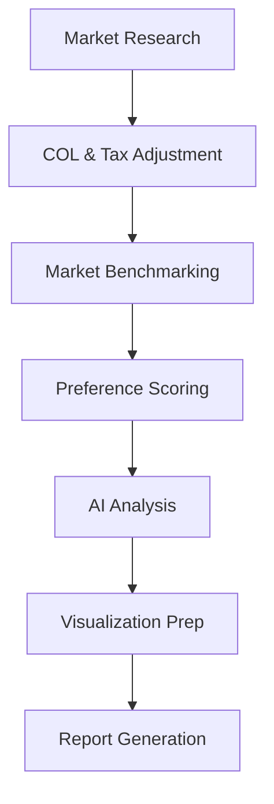

# OfferCompare Pro - Intelligent Job Offer Analysis Platform

<div align="center">


**AI-Powered Career Decision Support Tool**

[](https://www.python.org/downloads/)
[](https://nodejs.org/)
[](https://github.com/The-Pocket/PocketFlow)
[](https://opensource.org/licenses/MIT)

</div>

## 🎯 Overview

OfferCompare Pro is an intelligent job offer analysis platform that helps professionals make data-driven career decisions. It compares compensation packages, work-life balance metrics, and growth opportunities with real-time tax-adjusted net pay analysis and AI-powered recommendations.

### ✨ Key Features

- **🏆 Comprehensive Offer Comparison** - Multi-factor analysis beyond base salary
- **💰 Tax & Net Pay Engine** - Estimated take-home pay analysis (Federal + State + FICA)
- **🌍 Cost of Living Analysis** - Location-based compensation normalization  
- **📊 Market Benchmarking** - Industry salary data and percentile comparison
- **🎯 Personalized Scoring** - Weighted evaluation based on your specific priorities
- **🤖 Multi-AI Analysis** - Insights powered by Google Gemini, OpenAI, or Anthropic
- **💻 Interactive Dashboard** - Modern Next.js interface with real-time visualizations
- **📋 Actionable Reports** - Strategic decision frameworks and negotiation tips

## 🚀 Quick Start

### Prerequisites

- **Backend**: Python 3.10+
- **Frontend**: Node.js 18+ and npm
- **AI**: At least one API key (Gemini, OpenAI, or Claude)

### Installation

1. **Clone and Setup Backend:**
   ```bash
   git clone https://github.com/your-repo/OfferCompare.git
   cd OfferCompare
   conda env create -f environment.yml
   conda activate offercompare-pro
   pip install -r requirements.txt
   ```

2. **Configure Environment:**
   Create a `.env` file in the root directory:
   ```env
   GEMINI_API_KEY=your_key_here
   OPENAI_API_KEY=your_key_here
   ANTHROPIC_API_KEY=your_key_here
   DEFAULT_AI_PROVIDER=gemini
   ```

3. **Install Frontend:**
   ```bash
   cd frontend
   npm install
   ```

### Running the Application

1. **Start Backend (Terminal 1):**
   ```bash
   python api_server.py
   # Runs on http://localhost:8001
   ```

2. **Start Frontend (Terminal 2):**
   ```bash
   cd frontend
   npm run dev
   # Runs on http://localhost:3000 (usually)
   ```

## 📖 How to Use

### 1. Web Dashboard (Recommended)
Open your browser to `http://localhost:3000` to use the interactive interface. Add offers, adjust your preferences, and generate a comprehensive AI analysis with one click.

### 2. CLI Mode
You can also run a quick demo via the terminal:
```bash
python main.py --demo
```

## 🏗️ Architecture

Built on the **PocketFlow** graph framework for deterministic LLM orchestration:



### Core Logic Structure
- **utils/tax_calculator.py**: Engine for calculating site-specific take-home pay.
- **utils/call_llm.py**: Multi-provider LLM interface with smart retry logic and model cascade (Gemini, OpenAI, Claude).
- **nodes.py**: 7+ processing nodes for data enrichment and analysis with parallel async execution.
- **api_server.py**: FastAPI backend serving the analysis results.

## 🛠️ Development

### Project Structure
```
OfferCompare/
├── 📁 frontend/        # Next.js React Application
├── 📁 utils/           # Core Logic & Calculations
│   ├── tax_calculator.py # Tax & Net Pay Engine
│   ├── col_calculator.py # Cost of Living
│   ├── call_llm.py     # Multi-provider LLM interface
│   └── scoring.py      # Personalized scoring
├── 📄 nodes.py         # PocketFlow processing nodes
├── 📄 api_server.py    # FastAPI Backend
└── 📄 main.py          # CLI Entry Point
```

## 📄 License
MIT License - Made with ❤️ for the tech community.
